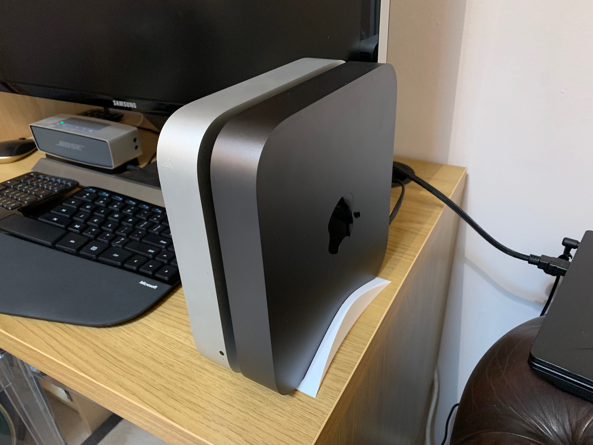

# ha-dual-mac-mini-stand
Home Automation: A 3D printable dual mac-mini stand

3D printing files and details can be found here: https://www.myminifactory.com/object/3d-print-dual-apple-mac-mini-stand-90163

This is a simple single part print for a stand to hold two post 2011 Apple mac minis. I've added a little wriggle room (1mm) for the macs so no post-processing needs to be done on the print.

This has been printed on my FlashForge Inventor in PLA and prints easily with no need for any additional supports, rafts of brims. As it's got a pretty large base I recommend using the anti-freeze trick to get it off the print bed.

Happy printing!

Additional files available on this GitHub repo are:

* MacMiniStand.gx - The G-Code print file sliced for printing on a FlashForge Inventor using PLA in the right-hand-side extruder.
* MacMiniStand.stl - The STL file for the print which was generated from the Fusion 360 model
* Dual Stand 2.f3z - Autodesk Fusion 360 model archive